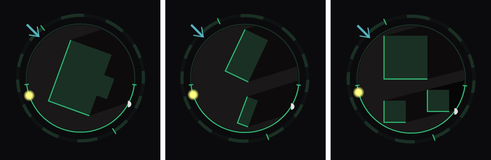

# Sun-and-Moon-script-for-Habpanel
Python script to create SVG file with sun and moon positions in relation to your hause

I have adapted the @pmpkk and @kriznik script to the latest astral (v.3.2). The astral library now provides data for the moon, so installing pytz and plunar will no longer be necessary.
I have converted the script to modular, so there is the possibility to include two buildings (optional). It will also be easy to rewrite the script for more shapes, if someone would need it.
pictures of widget with multiple shapes:



## GUIDELINE

## OPENHAB
You need to:
•	add astro:sun Thing based on astro binding.
•	create Sun_Azimuth Item (Number:Angle) and link it with the position#azimuth channel of astro:sun Thing

## SHELL
You need to install python3:
```
apt update && apt install python3 python3-pip -y
```
and additional astral library:
```
sudo pip install astral
```
Note: only astral library is needed. pytz and plunar are not needed any more.

## SCRIPT
You need to put the shaddow.py script into your computer. Default location is: /etc/openhab/scripts/.
If you wish you could change this location (remember to change this in your openHAB rule).
Script is written in python3:
script code

You have to change data to your location:
```
LATITUDE = youLatitude (eg. 51.505272)
LONGITUDE = yourLongitude (eg. -0.159548)
TIMEZONE = „yourTimezone” (eg. „Europe/London”)
TOWN = „yourTown” (eg. „London”)
```
You should change and add/remove points (corners) of your house:
```
SHAPE = [
      { 'x': yourXvalueOfFirstCorner, 'y': yourYvalueOfFirstCorner }, \
      { 'x': yourXvalueOfSecondCorner, 'y': yourYvalueOfSecondCorner }, \
      { 'x': yourXvalueOfThirdCorner, 'y': yourYvalueOfThirdCorner }, \
      { 'x': yourXvalueOfFourthCorner, 'y': yourYvalueOfFourthCorner }
   ]
```
You could add points of your offset garage (optional):
```
SHAPE_2 = [
      { 'x': yourXvalueOfFirstCorner, 'y': yourYvalueOfFirstCorner }, \
      { 'x': yourXvalueOfSecondCorner, 'y': yourYvalueOfSecondCorner }, \
      { 'x': yourXvalueOfThirdCorner, 'y': yourYvalueOfThirdCorner }, \
      { 'x': yourXvalueOfFourthCorner, 'y': yourYvalueOfFourthCorner }
   ]
```
Note: shapes have to be inside in the 100 x 100pt square.
Note: you should use any graphical program to read X and Y value of each corner of your house.
Note: You could start from any point, but point order have to be clockwise.
Below is the drawing how to order points in the shapes:
picture with point order

You could change additional settings:
```
FILENAME = ‘yourSVGfileNameAndLocation' (default ‘/etc/openhab/html/shaddow.svg')
WIDTH = HEIGHT = 100
PRIMARY_COLOR = '#1b3024'
LIGHT_COLOR = '#26bf75'
BG_COLOR = '#1a1919'
SUN_COLOR = '#ffff7d'
SUN_RADIUS = 5
MOON_COLOR = '#e1e1e1'
MOON_RADIUS = 3
WIND_COLOR = '#52b4bf'
STROKE_WIDTH = '1'
HOURS = 1
```
Below you have drawing with explanation of settings.
picture with color legend

To check if script works properly, you can start it:
```
python3 /etc/openhab/scripts/shaddow.py
```
with optional parameters:
1.	update		- updates the SVG image
2.	wind angle	- draws the wind arrow with given angle. Should be number between 0 – 360 degrees.
3.	debug		- runs script in debug mode
Note: It is necessary to specify the preceding parameters if you want to use the following ones.
### Example:
Ad.1 Update of SVG file without wind arrow:
```
python3 /etc/openhab/scripts/shaddow.py update
```
Ad.2 Update of SVG file with wind arrow:
```
python3 /etc/openhab/scripts/shaddow.py update 54
```
Ad.3 Update of SVG file with wind arrow in debug mode:
```
python3 /etc/openhab/scripts/shaddow.py update 54 debug
```
## RULE
You need to create a rule to call the script:

### DSL (without wind arrow)
```
rule "Generate shaddow SVG"
when
    Item Sun_Azimuth received update
then
    executeCommandLine( "python3", "/etc/openhab/scripts/shaddow.py", "update" )
end
```
### DSL (with wind arrow)
```
rule "Generate shaddow SVG"
when
    Item Sun_Azimuth received update or
    Item Wind_Angle received update 
then
    executeCommandLine( "python3", "/etc/openhab/scripts/shaddow.py", "update", (Wind_Angle.state as Number).floatValue.toString )
end
```
### Jython

Note: If you have put the script to other location, you need to change path in the rule.
Note: if your Items have other name, you have to use their names in the rule.

## HABPANEL
To add to HABPanel:
Add a template widget with this content:
```
<object data="/static/matrix-theme/shaddow.svg?{{itemValue('Sun_Azimuth')}}" type="image/svg+xml"></object>
```
The ?{{itemValue(‘Sun_Azimuth’)}} ensures that the SVG gets refreshed automatically as the azimuth changes.

Note: If you have changed the location or name of SVG file in the script, you need to change these in the template definition.
Note: If you have named sun azimuth Item otherwise, you need to use this name in the template definition.
